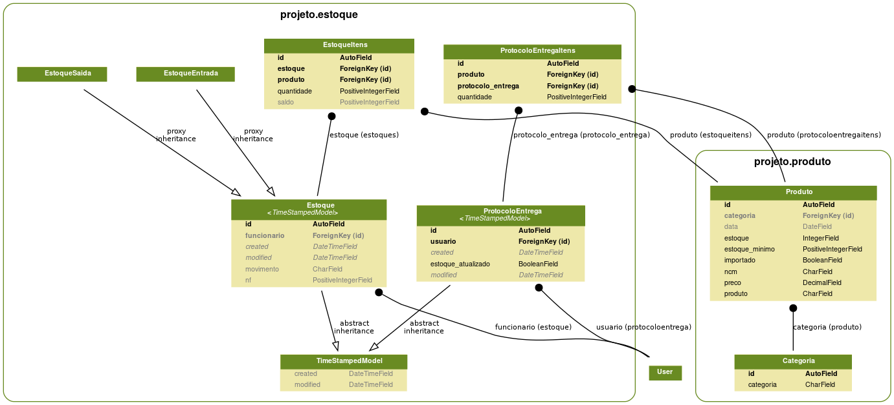

# Estoque

Controle de estoque


## Como rodar o projeto?

* Clone esse repositório.
* Crie um virtualenv com Python 3.
* Ative o virtualenv.
* Instale as dependências.
* Rode as migrações.

```bash
git clone https://github.com/rg3915/estoque.git
cd estoque
python3 -m venv .venv
source .venv/bin/activate
pip install -r requirements.txt
python contrib/env_gen.py
python manage.py migrate
python manage.py createsuperuser
python manage.py runserver
```

## Modelo



## Links

[python-decouple](https://github.com/henriquebastos/python-decouple)

[package-of-the-week-python-decouple](https://simpleisbetterthancomplex.com/2015/11/26/package-of-the-week-python-decouple.html)

[github.com/rg3915/tutoriais django-basic](https://github.com/rg3915/tutoriais/tree/master/django-basic)

[bootstrap starter-template](https://getbootstrap.com/docs/4.0/getting-started/introduction/#starter-template)

[emmet](https://emmet.io/)

[start.html](https://github.com/JTruax/bootstrap-starter-template/blob/master/template/start.html)

[django-widget-tweaks](https://github.com/jazzband/django-widget-tweaks)

[Class Based View - ccbv.co.uk](https://ccbv.co.uk/)

[form-inline](http://felipefrizzo.github.io/post/form-inline/)

[form-inline-cbv](http://felipefrizzo.github.io/post/form-inline-cbv/)

[django-bootstrap-form](https://django-bootstrap-form.readthedocs.io/en/latest/)

[Paginação - gist](https://gist.github.com/rg3915/01ca76f099f431c24bc0536bef83076b)

[Paginação - Bootstrap](https://getbootstrap.com/docs/4.3/components/pagination/)

